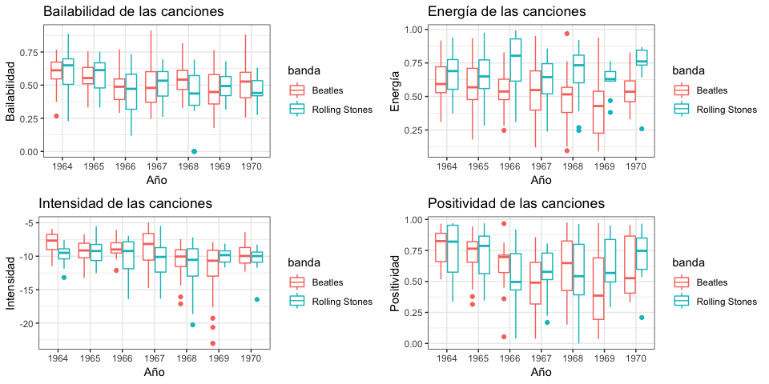

<style type="text/css">
body, td {
   font-size: 14px;
}
code.r{
  font-size: 11px;
}
pre {
  font-size: 11px
}
</style>

Va mi contribución al **#datosdemiercoles del 2019-05-15.**

Algunos comentarios preliminares. Tuve que usar el paquete spotifyr en vez del Rspotify, porque no podía descargar las canciones de los albumes.

Lo que decidí hacer, luego de aprender a descargar la data de Spotify gracias al código de @R4DS_es es comparar a las dos mayores bandas del rock mundial, los Rolling vs los Beatles. 

Para ello descargué los albumns y luego los nombres de las canciones de dichos albumns, para unirlos y descargar la información respectiva. Use este código para ello:


```r
library(spotifyr) #tuve que usar este paquete en vez del Rspotify porque tenía más versatilidad
library(tidyverse)
library(gridExtra)

app_id <- 'App-demon02' # el nombre que pusiste en la aplicacion
client_id<- 'b4456d96b1ba4d9898b300f1f3b23832' # el client id que figura en la web de spotify
client_secret <- 'e2d48ae635194372acb7d8c7474a55dc' # el client secret que figura en la web de spotify

keys2 <- get_spotify_access_token(client_id = client_id, client_secret = client_secret) #para el paquete spotifyr

# Rolling Stones ----------------------------------------------------------

rolling_albums1 <- get_artist_albums("22bE4uQ6baNwSHPVcDxLCe",
                                    include_groups = c("album"), market = NULL, limit = 50, offset = 0,
                                    authorization = keys2,
                                    include_meta_info = FALSE) 

rolling_albums2 <- get_artist_albums("22bE4uQ6baNwSHPVcDxLCe",
                                    include_groups = c("album"), market = NULL, limit = 50, offset = 50,
                                    authorization = keys2,
                                    include_meta_info = FALSE) 
rolling_albums3 <- get_artist_albums("22bE4uQ6baNwSHPVcDxLCe",
                                     include_groups = c("album"), market = NULL, limit = 50, offset = 100,
                                     authorization = keys2,
                                     include_meta_info = FALSE) 

rolling_albums <- bind_rows(rolling_albums1, rolling_albums2, rolling_albums3)
rolling_albums_limpio <- rolling_albums %>% 
    distinct(... = release_date, .keep_all = TRUE) # unicos

rolling_albums_tracks <- rolling_albums_limpio %>% 
    select(id, name, release_date) %>% 
    mutate(album_info=purrr::map(.x=id,
                                 .f=get_album_tracks,
                                 authorization=keys2))
rolling_unnest <- rolling_albums_tracks %>% 
    unnest(album_info) %>% 
    select(release_date, disco = name, duration_ms, cancion = name1, id1, track_number) 

rolling_track_data1 <- get_track_audio_features(rolling_unnest$id1[1:100], authorization = keys2)
rolling_track_data2 <- get_track_audio_features(rolling_unnest$id1[101:200], authorization = keys2)
rolling_track_data3 <- get_track_audio_features(rolling_unnest$id1[201:300], authorization = keys2)
rolling_track_data4 <- get_track_audio_features(rolling_unnest$id1[301:400], authorization = keys2)
rolling_track_data5 <- get_track_audio_features(rolling_unnest$id1[401:500], authorization = keys2)
rolling_track_data6 <- get_track_audio_features(rolling_unnest$id1[501:600], authorization = keys2)
rolling_track_data7 <- get_track_audio_features(rolling_unnest$id1[601:700], authorization = keys2)
rolling_track_data8 <- get_track_audio_features(rolling_unnest$id1[701:731], authorization = keys2)


rolling_track_data <- bind_rows(rolling_track_data1,
                                rolling_track_data2,
                                rolling_track_data3,
                                rolling_track_data4,
                                rolling_track_data5, 
                                rolling_track_data6,
                                rolling_track_data7,
                                rolling_track_data8)

rolling_final <- rolling_unnest %>% 
    left_join(rolling_track_data, by= c("id1" = "id")) %>% 
    mutate(ano = substr(release_date, 1, 4)) %>% 
    select(-duration_ms.x, -id1, -type, -uri, -track_href, -analysis_url, -release_date) %>% 
    mutate(banda = "Rolling Stones")


# Beatles -----------------------------------------------------------------

beatles_albums <- get_artist_albums("3WrFJ7ztbogyGnTHbHJFl2",
                                    include_groups = c("album"), market = NULL, limit = 50, offset = 0,
                                    authorization = keys2,
                                    include_meta_info = FALSE) 
beatles_albums_limpio <- beatles_albums %>% 
    distinct(... = release_date, .keep_all = TRUE) # unicos

beatles_albums_tracks <- beatles_albums_limpio %>% 
    select(id, name, release_date) %>% 
    mutate(album_info=purrr::map(.x=id,
                                 .f=get_album_tracks,
                                 authorization=keys2))
beatles_unnest <- beatles_albums_tracks %>% 
    unnest(album_info) %>% 
    select(release_date, disco = name, duration_ms, cancion = name1, id1, track_number) 

beatles_track_data1 <- get_track_audio_features(beatles_unnest$id1[1:100], authorization = keys2)
beatles_track_data2 <- get_track_audio_features(beatles_unnest$id1[101:200], authorization = keys2)
beatles_track_data3 <- get_track_audio_features(beatles_unnest$id1[201:300], authorization = keys2)
beatles_track_data4 <- get_track_audio_features(beatles_unnest$id1[301:318], authorization = keys2)

beatles_track_data <- bind_rows(beatles_track_data1,
                                beatles_track_data2,
                                beatles_track_data3,
                                beatles_track_data4)

beatles_final <- beatles_unnest %>% 
    left_join(beatles_track_data, by= c("id1" = "id")) %>% 
    mutate(ano = substr(release_date, 1, 4)) %>% 
    select(-duration_ms.x, -id1, -type, -uri, -track_href, -analysis_url, -release_date) %>% 
    mutate(banda = "Beatles")
```

Luego uni todo y lo filtré para que las fechas sean más o menos comparables. Por cuestiones obvias, los Beatles dejaron de publicar discos a partir del año 1970, mientras que los Rolling siguen activos hasta hoy. Para compararlos utilicé los discos que publicaron entre 1963 y 1970.

```r
rolling_beatles <- bind_rows(rolling_final, beatles_final)

rolling_beatles_anos <- rolling_beatles %>% 
    filter(ano >1963 & ano <= 1970)
```

Y por último hice los gráficos de box plot por año. Estos gráficos no son tan claros, pero usar solo la media nos dejaba a fuera información sobre quizás un tema outlier que sea muy bailable, etc. Habrá que mirarlos con cuidado entonces

```r
positividad <- ggplot(data = rolling_beatles_anos)+
    geom_boxplot(aes(x= ano, y = valence, color = banda))+
    labs(title = "Positividad de las canciones", 
         y = "Positividad", x = "Año")+
    theme_bw()
energia <- ggplot(data = rolling_beatles_anos)+
    geom_boxplot(aes(x= ano, y = energy, color = banda))+
    labs(title = "Energía de las canciones", 
         y = "Energía", x = "Año")+
    theme_bw()
intensidad <- ggplot(data = rolling_beatles_anos)+
    geom_boxplot(aes(x= ano, y = loudness, color = banda))+
    labs(title = "Intensidad de las canciones", 
         y = "Intensidad", x = "Año")+
    theme_bw()
dance <- ggplot(data = rolling_beatles_anos)+
    geom_boxplot(aes(x= ano, y = danceability, color = banda))+
    labs(title = "Bailabilidad de las canciones", 
         y = "Bailabilidad", x = "Año")+
    theme_bw()

grid.arrange(dance, energia, intensidad, positividad)
```

<!-- -->
De estos gráficos puede concluirse que, en terminos generales, las canciones de los Rolling y de los Beatles son bastante similares en bailabilidad, tienen un poco más de energía  las de los Rolling, en intensidad (_loudness_) las de los Beatles apenitas más, y en terminos de "positividad" (_valence_)^[https://community.spotify.com/t5/Content-Questions/Valence-as-a-measure-of-happiness/td-p/4385221] son un poco más positivas las de los Rolling.

Como sugiere @violetrzn habría que ver cuáles son los outliers, pero eso quedará para más adelante, o para quien quiera seguirlo!!

Un capo Jagger como siempre!

<iframe width="560" height="315" align="middle" src="https://www.youtube.com/embed/SS51lpatCcI" frameborder="0" allow="accelerometer; autoplay; encrypted-media; gyroscope; picture-in-picture" allowfullscreen></iframe>
